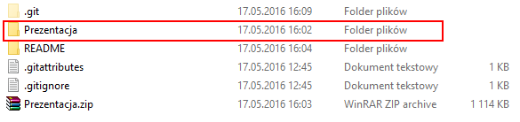

# Prezentacja-Latex-SI
Prezentacja z przedmiotu ISI na temat metodyki PCM

Powyższe repozytorium zawiera prezentację zrealizowaną w języku LATEX.

#Jak otworzyć prezentację w formacie PDF?

1. Pobieramy repozytorium na komputer.
2. Wchodzimy w:

3. Otwieramy:

#Jak odtworzyć wersję napisaną w języku LATEX?

1. Pobieramy repozytorium na komputer.
2. Wchodzimy na stronę: https://www.sharelatex.com/
3. Logujemy się na stronie lub rejestrujemy nowe konto.
4. Klikamy na:

5. Następnie na:

6. Do okna:

7. Przeciągamy plik:

7. do wcześniejszego okna i otworzy nam się zaimportowany projekt.
8. Teraz wystarczy tylko wcisnąć:

9. W tym momencie wyświetli nam się kod projektu (po lewej stronie) i podgląd projektu (po prawej stronie).

